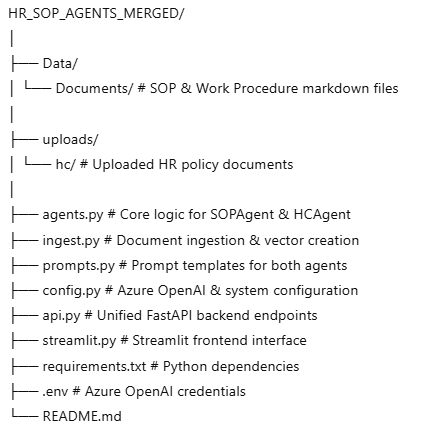

# PT Bio Farma – Unified SOP & Human Capital Assistant

A **dual-agent GenAI system** built using **Azure OpenAI + LangChain + FastAPI + Streamlit**, designed to assist employees at **PT Bio Farma** by providing instant answers to:

1. **SOP & Work Procedure Queries**
2. **Human Capital & HR Policy Queries**

---

## 📌 Project Overview

This system combines **two intelligent AI agents** into one unified platform:

### **Agent 1 – SOP & Work Procedure Assistant**
- **Persona:** Filman Galuh Purnawidjaya  
  *AVP Kepatuhan (Compliance)*  
- **Users:** All Employees  
- **Purpose:**  
  SOP documents and Work Procedures from the knowledge base are processed by the GenAI system to provide quick and concise answers to questions related to company procedures.

---

### **Agent 2 – Human Capital Assistant**
- **Persona:**  
  - Ditya Handayani – VP Layanan Human Capital  
  - Janathan – AVP Manajemen Talenta  
- **Users:** All Employees  
- **Purpose:**  
  Human Capital data and HR policy documents are processed by the GenAI system to answer queries related to employee policies, regulations, benefits, and administrative HR processes.

---

## ⚙️ Technology Stack

- **Azure OpenAI** (LLM + Embeddings)
- **LangChain** (RAG Pipeline)
- **FAISS** (Vector Database)
- **FastAPI** (Backend REST API)
- **Streamlit** (Frontend UI)
- **Python**

---

## 📂 Folder Structure

  

